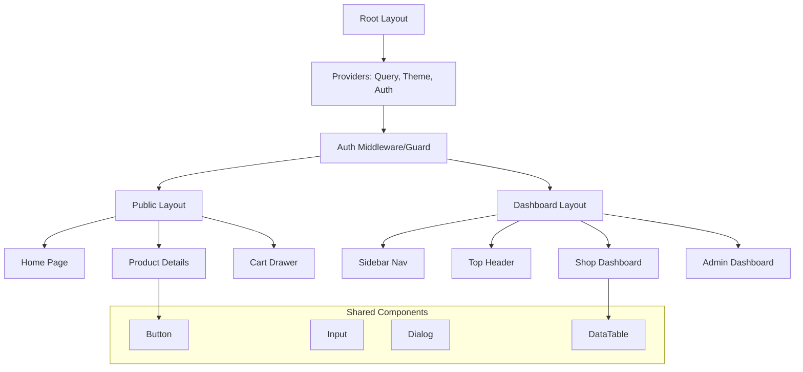

# Frontend Architecture & Blueprints

## 1. High-Level Visualization

### Component Hierarchy (Web)


---

## 2. Web Application (Next.js 14+)

### A. Detailed Directory Structure (The "Tree")

This structure follows a **Feature-First** approach. Everything related to a feature (components, hooks, utils) stays close to that feature.

```
web/
├── .env.local                              # Environment Variables
├── next.config.js                          # Next.js Config
├── tailwind.config.ts                      # Tailwind Config
├── tsconfig.json                           # TypeScript Config
│
├── app/                                    # App Router (Routes)
│   ├── (auth)/                             # Route Group: Authentication
│   │   ├── login/
│   │   │   └── page.tsx                    # Login Screen
│   │   ├── register/
│   │   │   └── page.tsx                    # Registration Screen
│   │   └── layout.tsx                      # Auth Layout (Centered Card)
│   │
│   ├── (dashboard)/                        # Route Group: Protected Dashboards
│   │   ├── admin/                          # Admin Routes
│   │   │   ├── page.tsx                    # Admin Dashboard Overview
│   │   │   ├── users/
│   │   │   │   ├── page.tsx                # User Management (List/Search/Filter)
│   │   │   │   └── [id]/page.tsx           # User Details & Actions (Ban/Suspend)
│   │   │   ├── shops/
│   │   │   │   ├── page.tsx                # Shop Verification Queue
│   │   │   │   └── [id]/
│   │   │   │       ├── page.tsx            # Shop Details & Verification
│   │   │   │       └── edit/page.tsx       # Edit Shop Info
│   │   │   ├── products/
│   │   │   │   ├── page.tsx                # Product Moderation (Flagged/Reported)
│   │   │   │   ├── master-catalog/page.tsx # Global Catalog Management
│   │   │   │   └── [id]/page.tsx           # Product Review & Actions
│   │   │   ├── orders/
│   │   │   │   ├── page.tsx                # Order Monitoring & Disputes
│   │   │   │   └── [id]/page.tsx           # Order Details & Resolution
│   │   │   ├── reviews/
│   │   │   │   ├── page.tsx                # Review Moderation (Flagged)
│   │   │   │   └── [id]/page.tsx           # Review Details & Actions
│   │   │   ├── promotions/
│   │   │   │   ├── page.tsx                # Promotion Management
│   │   │   │   ├── new/page.tsx            # Create Promotion
│   │   │   │   └── [id]/page.tsx           # Edit Promotion
│   │   │   ├── drivers/
│   │   │   │   ├── page.tsx                # Driver Verification & Management
│   │   │   │   └── [id]/page.tsx           # Driver Details & Performance
│   │   │   ├── gigs/
│   │   │   │   ├── page.tsx                # Gig Batch Monitoring
│   │   │   │   └── disputes/page.tsx       # Gig Dispute Resolution
│   │   │   ├── analytics/
│   │   │   │   ├── page.tsx                # Platform Analytics Dashboard
│   │   │   │   ├── revenue/page.tsx        # Revenue & Commission Reports
│   │   │   │   └── users/page.tsx          # User Behavior Analytics
│   │   │   ├── settings/
│   │   │   │   ├── page.tsx                # Platform Settings
│   │   │   │   ├── categories/page.tsx     # Category Management
│   │   │   │   ├── plans/page.tsx          # Subscription Plans Config
│   │   │   │   └── fees/page.tsx           # Commission & Fee Structure
│   │   │   └── reports/
│   │   │       ├── page.tsx                # User Reports Dashboard
│   │   │       └── [id]/page.tsx           # Report Details & Action
│   │   ├── shop/                           # Shopkeeper Routes
│   │   │   ├── page.tsx                    # Shop Dashboard Overview
│   │   │   ├── products/
│   │   │   │   ├── [id]/page.tsx           # Edit Product
│   │   │   │   ├── new/page.tsx            # Create Product
│   │   │   │   └── page.tsx                # Product List
│   │   │   ├── orders/
│   │   │   │   ├── page.tsx                # Order Kanban/Table
│   │   │   │   └── [id]/page.tsx           # Order Details
│   │   │   ├── negotiations/
│   │   │   │   ├── page.tsx                # Active Negotiations
│   │   │   │   └── [id]/page.tsx           # Negotiation Chat
│   │   │   ├── reviews/page.tsx            # Customer Reviews
│   │   │   ├── analytics/page.tsx          # Charts & Stats
│   │   │   ├── subscription/page.tsx       # Plan & Billing
│   │   │   ├── wallet/page.tsx             # Wallet & Payouts
│   │   │   └── layout.tsx                  # Dashboard Shell (Sidebar + Navbar)
│   │   │
│   │   ├── customer/                       # Customer Dashboard
│   │   │   ├── page.tsx                    # Customer Overview
│   │   │   ├── orders/
│   │   │   │   ├── page.tsx                # Order History
│   │   │   │   └── [id]/page.tsx           # Order Tracking
│   │   │   ├── negotiations/page.tsx       # My Negotiations
│   │   │   ├── reviews/page.tsx            # My Reviews
│   │   │   ├── wallet/page.tsx             # Wallet Balance
│   │   │   └── profile/page.tsx            # Profile Settings
│   │   │
│   │   ├── driver/                         # Driver Dashboard
│   │   │   ├── page.tsx                    # Driver Overview
│   │   │   ├── deliveries/
│   │   │   │   ├── page.tsx                # Active Deliveries
│   │   │   │   └── [id]/page.tsx           # Delivery Details & Map
│   │   │   ├── earnings/page.tsx           # Earnings & Payouts
│   │   │   ├── wallet/page.tsx             # Wallet
│   │   │   └── profile/page.tsx            # Driver Profile
│   │   │
│   │   ├── gig-worker/                     # Gig Worker Dashboard
│   │   │   ├── page.tsx                    # Available Gigs
│   │   │   ├── my-bids/page.tsx            # My Bids
│   │   │   ├── active-jobs/page.tsx        # Active Jobs
│   │   │   ├── earnings/page.tsx           # Earnings History
│   │   │   └── wallet/page.tsx             # Wallet
│   │   │
│   │   ├── subscriptions/                  # Subscription Management
│   │   │   ├── page.tsx                    # Plans Selection
│   │   │   ├── checkout/page.tsx           # Subscription Checkout
│   │   │   └── manage/page.tsx             # Manage Subscription
│   │   │
│   │   ├── leaderboard/                    # Gamification
│   │   │   └── page.tsx                    # Leaderboard Rankings
│   │   └── layout.tsx                      # Auth Guard (Middleware check)
│   │
│   ├── (storefront)/                       # Route Group: Public Shopping
│   │   ├── page.tsx                        # Home Page
│   │   ├── product/[slug]/
│   │   │   ├── loading.tsx                 # Skeleton Loader
│   │   │   └── page.tsx                    # Product Details (SSR)
│   │   ├── shop/[id]/
│   │   │   └── page.tsx                    # Shop Storefront
│   │   ├── search/
│   │   │   └── page.tsx                    # Search Results with Filters
│   │   ├── categories/
│   │   │   ├── page.tsx                    # All Categories
│   │   │   └── [slug]/page.tsx             # Category Products
│   │   ├── cart/
│   │   │   └── page.tsx                    # Full Cart Page
│   │   ├── checkout/
│   │   │   ├── page.tsx                    # Checkout Flow
│   │   │   └── success/page.tsx            # Order Success
│   │   ├── mandi/
│   │   │   └── page.tsx                    # Mandi Prices
│   │   └── about/
│   │       ├── page.tsx                    # About Us
│   │       ├── contact/page.tsx            # Contact
│   │       └── terms/page.tsx              # Terms & Privacy
│   │
│   ├── api/                                # Route Handlers (BFF / Proxy)
│   │   ├── auth/[...nextauth]/route.ts     # Auth Handlers
│   │   └── upload/route.ts                 # S3 Presigned URL
│   │
│   ├── layout.tsx                          # Root Layout (Providers: Query, Theme, Toast)
│   └── globals.css                         # Tailwind Directives
│
├── components/
│   ├── ui/                                 # Shadcn Atoms (Do NOT edit logic here)
│   │   ├── button.tsx
│   │   ├── input.tsx
│   │   ├── select.tsx
│   │   ├── dialog.tsx
│   │   ├── table.tsx
│   │   ├── sheet.tsx
│   │   ├── toast.tsx
│   │   ├── badge.tsx
│   │   ├── card.tsx
│   │   ├── tabs.tsx
│   │   ├── dropdown-menu.tsx
│   │   ├── command.tsx
│   │   └── skeleton.tsx
│   │
│   ├── common/                             # Reusable Molecules
│   │   ├── logo.tsx
│   │   ├── search-bar.tsx                  # Global Search
│   │   ├── user-nav.tsx                    # Avatar Dropdown
│   │   ├── theme-toggle.tsx
│   │   └── status-badge.tsx                # Colored badge (Pending/Active)
│   │
│   ├── features/                           # Organisms (Business Logic)
│   │   ├── auth/
│   │   │   ├── login-form.tsx
│   │   │   └── register-form.tsx
│   │   ├── products/
│   │   │   ├── product-card.tsx
│   │   │   ├── product-grid.tsx
│   │   │   ├── product-filters.tsx
│   │   │   ├── product-form.tsx            # Add/Edit Form
│   │   │   └── product-gallery.tsx         # Image Gallery with Zoom
│   │   ├── cart/
│   │   │   ├── cart-sheet.tsx              # Slide-over Drawer
│   │   │   └── cart-item.tsx
│   │   ├── orders/
│   │   │   ├── order-table.tsx
│   │   │   ├── order-status-select.tsx
│   │   │   └── order-tracking.tsx          # Live Tracking Map
│   │   ├── negotiations/
│   │   │   ├── negotiation-chat.tsx        # Chat Interface
│   │   │   └── offer-input.tsx             # Price Offer Input
│   │   ├── reviews/
│   │   │   ├── review-card.tsx
│   │   │   ├── review-form.tsx
│   │   │   └── rating-stars.tsx
│   │   ├── admin/
│   │   │   ├── user-table.tsx
│   │   │   ├── shop-verification-card.tsx
│   │   │   └── analytics-charts.tsx
│   │   ├── driver/
│   │   │   ├── delivery-map.tsx
│   │   │   └── delivery-request-card.tsx
│   │   └── gigs/
│   │       ├── gig-card.tsx
│   │       ├── bid-form.tsx
│   │       └── gig-status-badge.tsx
│   │
│   └── layouts/                            # Template Components
│       ├── site-header.tsx                 # Sticky Navbar
│       ├── site-footer.tsx
│       └── dashboard-sidebar.tsx
│
├── lib/                                    # Utilities & Config
│   ├── axios.ts                            # Axios instance with Interceptors
│   ├── socket.ts                           # Socket.io Client
│   ├── utils.ts                            # cn() class merger
│   ├── validators/                         # Zod Schemas
│   │   ├── auth.schema.ts
│   │   ├── product.schema.ts
│   │   ├── order.schema.ts
│   │   ├── negotiation.schema.ts
│   │   └── review.schema.ts
│   └── constants.ts                        # NavLinks, Configs
│
├── hooks/                                  # Custom Hooks
│   ├── use-auth.ts                         # User session
│   ├── use-cart.ts                         # Cart actions
│   ├── use-toast.ts                        # Notifications
│   ├── use-media-query.ts                  # Responsive checks
│   ├── use-socket.ts                       # WebSocket connection
│   ├── use-geolocation.ts                  # User location
│   └── use-debounce.ts                     # Debounce utility
│
├── store/                                  # Global State (Zustand)
│   ├── use-cart-store.ts                   # Persisted Cart State
│   ├── use-sidebar-store.ts                # UI State
│   ├── use-auth-store.ts                   # Auth State
│   ├── use-notification-store.ts           # Notifications
│   └── use-location-store.ts               # Geolocation State
│
├── types/                                  # TypeScript Interfaces
│   └── index.ts                            # Shared types
│
└── middleware.ts                           # Auth Protection
```

### B. Screen Specifications (UI/UX & Logic)

#### 1. Home Page (`/`)
-   **UI**:
    -   Hero Carousel with active Promotions (auto-play, 5s interval)
    -   Categories Grid (8 circular icons: Phones, Fashion, Grocery, Electronics, etc.)
    -   "Nearby Shops" row (horizontal scroll, distance badge)
    -   "Best Sellers" row (product cards with ratings)
    -   "Fresh from Mandi" (live prices, green/red indicators)
-   **UX**:
    -   Fast LCP (<2.5s), lazy load below fold
    -   Skeleton loaders for async content
-   **Logic**:
    -   `useQuery(['featured-products'])`, `useQuery(['nearby-shops', lat, lng])`
    -   Geolocation on mount (with permission prompt)

#### 2. Product Details (`/product/[slug]`)
-   **UI**:
    -   Left: Image Gallery (main + 4 thumbnails, zoom on hover, lightbox on click)
    -   Right: Title, Shop Name (link), Price (strikethrough if discounted), Rating (4.5★ 120 reviews)
    -   "Add to Cart" (primary), "Negotiate" (secondary), "Share" (icon)
    -   Tabs: Description | Specifications | Reviews (sortable)
    -   "More from this Shop" carousel
-   **UX**:
    -   Stock urgency: "Only 2 left!" (red badge if stock < 5)
    -   Negotiation opens Sheet (slide-over)
-   **Logic**:
    -   SSR for SEO, `useCartStore.addItem()`, Socket.io for real-time stock
    -   `useMutation(createNegotiation)`

#### 3. Negotiation Chat (Sheet)
-   **UI**:
    -   Product summary at top (image, name, original price)
    -   Chat bubbles (user: right/blue, shop: left/gray, system: center/yellow)
    -   Bottom: Currency input + "Make Offer" button
-   **UX**:
    -   Typing indicator ("Shop is typing...")
    -   Confetti animation on "Deal Accepted"
    -   Auto-scroll to latest message
-   **Logic**:
    -   WebSocket (`socket.io-client`), `useMutation(sendOffer)`
    -   On accept: redirect to cart with `signed_price_token`

#### 4. Shop Dashboard - Products (`/shop/products`)
-   **UI**:
    -   Header: "Products" + "Add New" (primary button)
    -   Data Table: Image | Name | SKU | Stock | Price | Status | Actions (Edit/Delete)
    -   Filters: Search (debounced), Category dropdown, Status (Active/Draft)
    -   Pagination (10/page)
-   **UX**:
    -   Bulk actions: Select checkboxes → "Delete Selected"
    -   Inline edit for stock/price (double-click)
-   **Logic**:
    -   `useQuery(['shop-products', page, filters])`, debounced search (500ms)
    -   `useMutation(deleteProduct)` with optimistic update

#### 5. Shop Dashboard - Add Product (`/shop/products/new`)
-   **UI**:
    -   Step 1: Global Catalog Search (autocomplete, "Search iPhone 15...")
    -   Step 2: If found → pre-filled form (Name, Desc, Images locked). If not → full form
    -   Pricing: Base Price, Discount %, Negotiation Range (Min/Max)
    -   Inventory: Stock, SKU, Variants (Size/Color)
    -   Images: Drag-and-drop upload (max 5, 2MB each)
-   **UX**:
    -   Validation errors inline (red text below field)
    -   "Save as Draft" (secondary) vs "Publish" (primary)
-   **Logic**:
    -   `react-hook-form` + `zod`, `useMutation(createProduct)`
    -   Image upload → presigned S3 URL via `/api/upload`

#### 6. Admin - Shop Verification (`/admin/shops`)
-   **UI**:
    -   Queue table: Shop Name | Owner | Category | Submitted Date | Actions
    -   Detail view: Shop info, Documents (GST, License), Map location
    -   Actions: "Approve" (green), "Reject" (red), "Request More Info" (yellow)
-   **UX**:
    -   Document viewer (PDF inline)
    -   Rejection requires reason (textarea)
-   **Logic**:
    -   `useQuery(['pending-shops'])`, `useMutation(verifyShop)`
    -   On approve: sends email + updates shop status

#### 7. Customer - Order Tracking (`/customer/orders/[id]`)
-   **UI**:
    -   Stepper: Pending → Accepted → Ready → Out for Delivery → Completed
    -   Live map (if out for delivery): Driver location, ETA
    -   Order summary: Items, Total, Delivery address
    -   "Cancel Order" (if status = PENDING), "Leave Review" (if COMPLETED)
-   **UX**:
    -   Real-time updates (toast notification on status change)
    -   Driver contact button (call/chat)
-   **Logic**:
    -   `useQuery(['order', id])`, Socket.io for status updates
    -   Google Maps API for driver location

#### 8. Driver - Delivery Map (`/driver/deliveries/[id]`)
-   **UI**:
    -   Full-screen map (Google Maps)
    -   Bottom sheet: Customer details, Delivery address, "Navigate" button
    -   Top: Delivery code input (4-digit OTP)
    -   "Mark as Delivered" (disabled until code entered)
-   **UX**:
    -   Route polyline (blue), driver marker (moving)
    -   Keep screen awake during delivery
-   **Logic**:
    -   `Geolocator.getPositionStream()` → WebSocket every 10s
    -   `useMutation(completeDelivery)` with delivery code

#### 9. Gig Worker - Available Gigs (`/gig-worker`)
-   **UI**:
    -   Card grid: Gig title, Budget, Distance, Posted time
    -   "Place Bid" button → opens modal with bid amount input
-   **UX**:
    -   Filter: Distance (<5km, <10km), Budget range
    -   Sort: Newest, Highest budget
-   **Logic**:
    -   `useQuery(['available-gigs', location])`, `useMutation(placeBid)`

#### 10. Leaderboard (`/leaderboard`)
-   **UI**:
    -   Tabs: Customers | Shopkeepers | Drivers
    -   Table: Rank | Avatar | Name | Points | Badges
    -   Current user highlighted (yellow row)
-   **UX**:
    -   Animated rank changes (up/down arrows)
    -   Badge tooltips (hover for description)
-   **Logic**:
    -   `useQuery(['leaderboard', tab])`, updates daily

---

## 3. Mobile Application (Flutter)

### A. Detailed Directory Structure

We follow **Clean Architecture** with a **Feature-First** split.

```
mobile/
├── lib/
│   ├── core/                               # Core Utilities (Layer Independent)
│   │   ├── api/
│   │   │   ├── dio_client.dart             # Dio Instance + Interceptors
│   │   │   └── endpoints.dart              # API URL Constants
│   │   ├── errors/
│   │   │   ├── exceptions.dart             # ServerException, CacheException
│   │   │   └── failures.dart               # Failure classes for UI
│   │   ├── theme/
│   │   │   ├── app_theme.dart              # ThemeData (Light/Dark)
│   │   │   └── app_colors.dart             # Color Palette
│   │   ├── router/
│   │   │   └── app_router.dart             # GoRouter Config
│   │   └── utils/
│   │       └── validators.dart             # Form Validators
│   │
│   ├── features/                           # Feature Modules
│   │   ├── auth/
│   │   │   ├── data/
│   │   │   │   ├── datasources/
│   │   │   │   │   ├── auth_remote_ds.dart
│   │   │   │   │   └── auth_local_ds.dart
│   │   │   │   ├── models/
│   │   │   │   └── repositories/
│   │   │   ├── domain/
│   │   │   │   ├── entities/
│   │   │   │   ├── repositories/
│   │   │   │   └── usecases/
│   │   │   └── presentation/
│   │   │       ├── providers/
│   │   │       └── screens/
│   │   │
│   │   ├── home/                           # Home Tab
│   │   ├── product/                        # Product Details & Search
│   │   ├── cart/                           # Cart & Checkout
│   │   ├── orders/                         # Order History & Tracking
│   │   ├── negotiations/                   # Negotiation Chat
│   │   ├── reviews/                        # Reviews & Ratings
│   │   ├── shop/                           # Shop Management (Shopkeeper)
│   │   ├── driver/                         # Driver Delivery Features
│   │   │   └── presentation/
│   │   │       └── screens/
│   │   │           └── delivery_map_screen.dart
│   │   ├── gigs/                           # Gig Worker Features
│   │   ├── wallet/                         # Wallet & Transactions
│   │   ├── leaderboard/                    # Gamification
│   │   └── profile/                        # User Profile & Settings
│   │
│   ├── shared/                             # Shared Widgets (Atoms/Molecules)
│   │   ├── buttons/
│   │   │   ├── primary_button.dart
│   │   │   └── secondary_button.dart
│   │   ├── inputs/
│   │   │   ├── custom_text_field.dart
│   │   │   └── search_field.dart
│   │   ├── cards/
│   │   │   └── product_card_widget.dart
│   │   └── dialogs/
│   │       └── error_dialog.dart
│   │
│   └── main.dart                           # Entry Point (ProviderScope)
│
├── assets/
│   ├── images/
│   ├── icons/
│   └── fonts/
│
└── pubspec.yaml
```

### B. Screen Specifications

#### 1. Main Tab Layout
-   **UI**: Bottom Navigation (Home, Search, Cart, Orders, Profile). FAB: "Scan QR".
-   **Logic**: `GoRouter` ShellRoute with persistent state.

#### 2. Driver - Delivery Map
-   **UI**: Full-screen Google Map, Bottom Sheet (Order details), Route polyline.
-   **UX**: Keep screen awake (`wakelock`), high-contrast map.
-   **Logic**: `Geolocator.getPositionStream()` → WebSocket (10s interval), Directions API.

#### 3. Offline Mode
-   **UI**: Greyed-out live features, "Offline" banner (yellow).
-   **Logic**: `ConnectivityPlus` listener, Dio interceptor → Hive cache.

#### 4. Negotiation Chat
-   **UI**: Chat bubbles (user/shop/system), offer input at bottom.
-   **Logic**: Socket.io connection, Riverpod state for messages.

#### 5. Product Details
-   **UI**: Image carousel, price, "Add to Cart", "Negotiate", reviews.
-   **Logic**: Cached product data (Hive), real-time stock via WebSocket.

---

## 4. Shared Design System

### A. Centralized Color Palette

#### Base Colors (Light Grey Foundation)
```css
/* Pure & Background Colors */
--color-white: #FFFFFF;                    /* Pure white - cards, modals */
--color-bg-primary: #F8F9FA;               /* Main app background */
--color-bg-secondary: #F2F3F5;             /* Card backgrounds, elevated surfaces */
--color-bg-tertiary: #E5E7EB;              /* Subtle backgrounds, disabled states */

/* Border & Divider Colors */
--color-border-light: #E5E7EB;             /* Soft borders, dividers */
--color-border-medium: #D1D5DB;            /* Input borders, card outlines */
--color-border-dark: #9CA3AF;              /* Active borders, focus rings */

/* Text Colors */
--color-text-primary: #1F2937;             /* Headings, primary content */
--color-text-secondary: #4B5563;           /* Body text, descriptions */
--color-text-tertiary: #9CA3AF;            /* Muted text, placeholders */
--color-text-disabled: #D1D5DB;            /* Disabled text */
```

#### Accent Colors (Brand & Actions)
```css
/* Primary Blue (Main Actions) */
--color-primary: #3B82F6;                  /* Primary buttons, links */
--color-primary-hover: #2563EB;            /* Hover state */
--color-primary-light: #EFF6FF;            /* Light tint, badges */
--color-primary-dark: #1E40AF;             /* Active/pressed state */

/* Success Green */
--color-success: #22C55E;                  /* Success messages, completed */
--color-success-light: #DCFCE7;            /* Success backgrounds */
--color-success-dark: #16A34A;             /* Success hover */

/* Warning Amber */
--color-warning: #F59E0B;                  /* Warnings, pending states */
--color-warning-light: #FEF3C7;            /* Warning backgrounds */
--color-warning-dark: #D97706;             /* Warning hover */

/* Error Red */
--color-error: #EF4444;                    /* Errors, destructive actions */
--color-error-light: #FEE2E2;              /* Error backgrounds */
--color-error-dark: #DC2626;               /* Error hover */

/* Info Blue */
--color-info: #06B6D4;                     /* Info messages, tips */
--color-info-light: #CFFAFE;               /* Info backgrounds */
--color-info-dark: #0891B2;                /* Info hover */
```

#### Transparent Overlays & Effects
```css
/* Shadows & Overlays */
--overlay-subtle: rgba(0, 0, 0, 0.05);     /* Subtle dividers, soft shadows */
--overlay-soft: rgba(0, 0, 0, 0.1);        /* Dropdown shadows, hover overlays */
--overlay-medium: rgba(0, 0, 0, 0.2);      /* Modal overlays, tooltips */
--overlay-strong: rgba(0, 0, 0, 0.4);      /* Dark overlays, image scrim */

/* Glass Effects */
--glass-white: rgba(255, 255, 255, 0.5);   /* Glassmorphism, frosted glass */
--glass-dark: rgba(0, 0, 0, 0.05);         /* Dark glass effect */

/* Gradient Overlays */
--gradient-primary: linear-gradient(135deg, #3B82F6 0%, #2563EB 100%);
--gradient-success: linear-gradient(135deg, #22C55E 0%, #16A34A 100%);
--gradient-overlay: linear-gradient(180deg, transparent 0%, rgba(0,0,0,0.6) 100%);
```

#### Semantic Colors (E-commerce Specific)
```css
/* Product & Shopping */
--color-price: #1F2937;                    /* Product prices */
--color-discount: #EF4444;                 /* Discount badges */
--color-stock-low: #F59E0B;                /* Low stock warning */
--color-stock-out: #EF4444;                /* Out of stock */
--color-rating: #F59E0B;                   /* Star ratings */

/* Status Colors */
--color-status-pending: #F59E0B;           /* Pending orders */
--color-status-processing: #3B82F6;        /* Processing */
--color-status-shipped: #06B6D4;           /* Shipped */
--color-status-delivered: #22C55E;         /* Delivered */
--color-status-cancelled: #EF4444;         /* Cancelled */

/* Shop & Verification */
--color-verified: #22C55E;                 /* Verified badge */
--color-premium: #F59E0B;                  /* Premium features */
--color-featured: #8B5CF6;                 /* Featured products */
```

#### Tailwind CSS Configuration
```javascript
// tailwind.config.ts
module.exports = {
  theme: {
    extend: {
      colors: {
        // Base
        'bg-primary': '#F8F9FA',
        'bg-secondary': '#F2F3F5',
        'bg-tertiary': '#E5E7EB',
        
        // Text
        'text-primary': '#1F2937',
        'text-secondary': '#4B5563',
        'text-tertiary': '#9CA3AF',
        
        // Border
        'border-light': '#E5E7EB',
        'border-medium': '#D1D5DB',
        'border-dark': '#9CA3AF',
        
        // Brand
        primary: {
          DEFAULT: '#3B82F6',
          50: '#EFF6FF',
          100: '#DBEAFE',
          500: '#3B82F6',
          600: '#2563EB',
          700: '#1E40AF',
        },
        success: {
          DEFAULT: '#22C55E',
          50: '#DCFCE7',
          500: '#22C55E',
          600: '#16A34A',
        },
        warning: {
          DEFAULT: '#F59E0B',
          50: '#FEF3C7',
          500: '#F59E0B',
          600: '#D97706',
        },
        error: {
          DEFAULT: '#EF4444',
          50: '#FEE2E2',
          500: '#EF4444',
          600: '#DC2626',
        },
      },
      boxShadow: {
        'soft': '0 2px 8px rgba(0, 0, 0, 0.05)',
        'medium': '0 4px 16px rgba(0, 0, 0, 0.1)',
        'strong': '0 8px 32px rgba(0, 0, 0, 0.15)',
        'glow-primary': '0 0 20px rgba(59, 130, 246, 0.3)',
        'glow-success': '0 0 20px rgba(34, 197, 94, 0.3)',
      },
    },
  },
}
```

#### Usage Examples
```tsx
// Button variants
<button className="bg-primary hover:bg-primary-600 text-white">
  Primary Action
</button>

<button className="bg-bg-secondary hover:bg-bg-tertiary text-text-primary border border-border-medium">
  Secondary Action
</button>

// Cards
<div className="bg-white border border-border-light shadow-soft rounded-lg">
  <div className="p-6">Card Content</div>
</div>

// Status badges
<span className="bg-success-50 text-success-600 px-2 py-1 rounded-full text-sm">
  Delivered
</span>

// Glass effect
<div className="bg-white/50 backdrop-blur-md border border-border-light">
  Glassmorphism Card
</div>

// Product price
<div className="flex items-center gap-2">
  <span className="text-2xl font-bold text-text-primary">₹999</span>
  <span className="text-sm line-through text-text-tertiary">₹1,499</span>
  <span className="text-sm font-semibold text-error">33% OFF</span>
</div>
```

### B. Typography
-   **Font**: `Inter` (Web) / `Inter` (Mobile)
-   **Headings**: Bold, Tight tracking.
-   **Body**: Regular, Relaxed.

### C. Icons
-   **Web**: `Lucide React`
-   **Mobile**: `Lucide Flutter` (or standard Material Icons)
